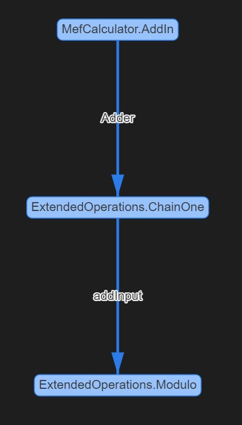

# VSMefx
A Composition Analysis Tool for VS-MEF

## Example Commands 

The application currently sets the working directory based on the testFolder field in the Program.cs file. If the testFolder is a subFolder in the Tests directory then the program sets the currently working directory to the specified testFolder. If the testFolder is a empty string then the currently working directory will be set to Tests. File and folder paths needed to be specified relative to the currently working directory for the application to be able to process them. When running the application through Visual Studio, the input command can be specified by navigating to the following section: Solution Properties (Right Click the VSMefx Solution in vs) -> Debug -> Start Options. 

### Part Information Getter 

The following command illustrates the basic functionality to get information about parts and thier types: 
```
-p -t MefCalculator.ExportTest -e MefCalculator.MefCalculatorInterfaces+IOperation -i MajorRevision --files MefCalculator.dll  -d Extensions
```

This command performs a variety of different operations and thus we will break down the command by those operations to understand
its functionality. We specify that we want to perform analysis on the MefCalculator.dll file as well as the Extensions folder through ` --files MefCalculator.dll  -d Extensions `. When a folder is specified, Mefx automatically finds all .dll and .exe files present in the folder itself along with its subfolders. 

The `-p` argument of the commands tells Mefx to list all the parts present in the input files and folders. The `-t` argument allows us to get more information on a particular part like `-t MefCalculator.ExportTest` prints out the imports and exports for the MefCalculator.ExportTest class. 

The `-e` command can be used to find the exporters of a given type like `-e MefCalculator.MefCalculatorInterfaces+IOperation` find all the parts/type that export as an IOperation. Finally, the `-i` can be used to find the classes that import a given type like `-i MinorRevision` finds all the parts that import MinorRevision. 

The above commands gives us the following output which shows the workings of all the features above: 
```
Parts in Catalog are
MefCalculator.AddIn
MefCalculator.ExportTest
MefCalculator.MefCalculatorInterfaces+Add
MefCalculator.MefCalculatorInterfaces+Subtract
ExtendedOperations.ChainOne
ExtendedOperations.ImportTest
ExtendedOperations.Modulo

Printing out details for part MefCalculator.ExportTest
[Export] MajorRevision
[Export] MinorRevision

Exporting parts for MefCalculator.MefCalculatorInterfaces+IOperation:
MefCalculator.MefCalculatorInterfaces+Add
MefCalculator.MefCalculatorInterfaces+Subtract
ExtendedOperations.Modulo

Importing parts for MajorRevision:
MefCalculator.MefCalculatorInterfaces+Subtract
```

### General Rejection Information

The following command showcases the ability of Mefx to share rejection information for all the input files and folders: 

```
-g -r all --files MefCalculator.dll -d Extensions
```

The main things that we want to focus on in this section are the `-g` and the `-r all` sections of the command. The `-r all` tells Mefx that we want information about all the rejections, and in the next example we will see how we can get rejection information about particular parts. The `-g` command tells Mefx to generate a [DGML file](https://docs.microsoft.com/en-us/visualstudio/modeling/directed-graph-markup-language-dgml-reference?view=vs-2019) to visualize the rejection graph and see which imports and parts are causing issues. 

The output of running the above command looks like: 
```
Listing errors in level 1
ExtendedOperations.Modulo

Listing errors in level 2
ExtendedOperations.ChainOne

Listing errors in level 3
MefCalculator.AddIn
ExtendedOperations.ImportTest

Saved rejection graph to all.dgml
```

Mefx classify parts that have import issues into different levels based on the cause of thier import issues. Parts on lower levels, parts with smaller level numbers, generally tend to have rejection issues because of the fact that they are importing a part that has failed imports itself, which means that the part they are trying to import will have a higher level number. 

Another way of saying the above statement is that rejections in lower levels tend to be caused by issues in a higher level and thus we can examine the root causes of our failed rejections by looking at issues at the highest level since the issues are guaranteed to not because of a part that they are importing. 

The saved DGML file has the parts that have import issues as the nodes and has directed edges between parts to indicate the flow of part imports. Since we only store the nodes that have rejection issues, any incoming edges into a graph can be interpreted as parts that are causing it to be rejected and any outgoing edges can be thought of as parts that it is causing to be rejected. 

The DGML diagram that is saved when we run the above command looks like 


### Specific Rejection Information 

When working with large projects and libraries with tons of .dll and .exe files, it will get painful to list/visualize a graph for all the import issues when we care about a single or only a couple of parts. Thus, Mefx allows users to indicate which part(s) they want to trace the rejection information about through commands such as: 
```
-gv -r ExtendedOperations.Modulo --files MefCalculator.dll -d Extensions
```

When a user specifies a part to get rejection information about, Mefx automatically finds parts whose import issues impact the specified part, which in this case is ExtendedOperations.Modulo. Thus, when displaying information or generating a graph, Mefx only presents reject issues that impact the specified part and ignores all others. The `-v` command stands for verbose and that can be used to print out additional information about the issues and the parts involved. 

The output of the above command is: 
```
Printing Rejection Graph Info for ExtendedOperations.Modulo

Errors in Level 1
ExtendedOperations.Modulo.addInput: expected exactly 1 export matching constraints:
    Contract name: ExtendedOperations.ChainOne
    TypeIdentityName: ExtendedOperations.ChainOne
but found 0.

Errors in Level 2
ExtendedOperations.ChainOne.Adder: expected exactly 1 export matching constraints:
    Contract name: MefCalculator.AddIn
    TypeIdentityName: MefCalculator.AddIn
but found 0.

Errors in Level 3
MefCalculator.AddIn.fieldTwo: expected exactly 1 export matching constraints:
    Contract name: ChainTwo
    TypeIdentityName: System.String
but found 0.

Saved rejection graph to ExtendedOperations_Modulo.dgml
```

Comparing this output to the previous output, we see that more rejected parts overall but Mefx automatically filtered out the rejections to only include those that affect the ExtendedOperations.Modulo part. Since the verbose option was chosen, Mefx prints out detailed information about the cause of the issue which can be used to quickly pinpoint and resolve the issue. We can see this filtering take place in the output DGML file as well as the output DGML file produced by the above command looks like: 

