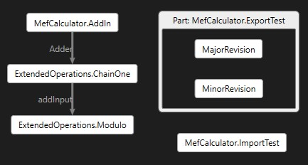
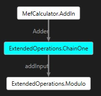

# VSMefx
A Composition Analysis Tool for VS-MEF

## Command Options Summary


## Example Commands 

The application currently sets the working directory based on the testFolder field in the Program.cs file. If the testFolder is a subFolder in the Tests directory then the program sets the currently working directory to the specified testFolder. If the testFolder is a empty string then the currently working directory will be set to Tests. File and folder paths needed to be specified relative to the currently working directory for the application to be able to process them. When running the application through Visual Studio, the input command can be specified by navigating to the following section: Solution Properties (Right Click the VSMefx Solution in vs) -> Debug -> Start Options. 

### Part Information Getter 

The following command illustrates the basic functionality to get information about parts and thier types: 
```
--parts --detail MefCalculator.ImportTest --exporter MefCalculator.MefCalculatorInterfaces+IOperation --importer ExtendedOperations.ChainOne  --file MefCalculator.dll --directory Extensions
```

This command performs a variety of different operations and thus we will break down the command by those operations to understand
its functionality. We specify that we want to perform analysis on the MefCalculator.dll file as well as the Extensions folder through ` --files MefCalculator.dll --directory Extensions `. When a folder is specified, Mefx automatically finds all valid files present in the folder itself along with its subfolders. 

Currently, Mefx considers any file with the extensions .dll, .exe, or .cache as valid files. Please note that the .cache file must have been created using the SaveAsync of the Cached Catalog in the main MEF library for Mefx to be able to properly process the file. Mefx allows users to store the catalog created from the files specified in the input argument by specifiying the output file name in the `--cache` option and thus can be called by including something like `--cache Combined.cache` in the command.

The `--parts` argument of the commands tells Mefx to list all the parts present in the input files and folders. The `--detail` argument allows us to get more information on a particular part by printing out all the imports and exports associated with the specified part name. 

The `--exporter` command can be used to find the exporters of a given contract name like `--exporter MefCalculator.MefCalculatorInterfaces+IOperation` finds all exports with the contract name of IOperation. Finally, the `--importer` can be used to find the parts that contains imports with a given contract name like `--importer MajorRevision`
finds all the parts that contain a import with the contract name of MajorRevision. 

The above commands gives us the following output which shows the workings of all the features above: 
```
Parts in Catalog are
MefCalculator.AddIn
MefCalculator.ExportTest
MefCalculator.ImportTest
MefCalculator.MefCalculatorInterfaces+Add
MefCalculator.MefCalculatorInterfaces+Subtract
ExtendedOperations.ChainOne
ExtendedOperations.Modulo

Printing out details for part MefCalculator.ImportTest
[Export] MefCalculator.ImportTest
[Import] Field: Operations, Contract Name: MefCalculator.MefCalculatorInterfaces+IOperation
[Import] Field: failingField, Contract Name: MissingField

Exporting parts for MefCalculator.MefCalculatorInterfaces+IOperation:
MefCalculator.MefCalculatorInterfaces+Add
MefCalculator.MefCalculatorInterfaces+Subtract
ExtendedOperations.Modulo

Importing parts for ExtendedOperations.ChainOne:
ExtendedOperations.Modulo
```

### General Rejection Information

The following command showcases the ability of Mefx to share rejection information for all the input files and folders: 

```
--graph --rejected all  --file MefCalculator.dll --directory Extensions
```

The main things that we want to focus on in this section are the `--graph` and the `--rejected all` sections of the command. The `-r all` tells Mefx that we want information about all the rejections, and in the next example we will see how we can get rejection information about particular parts. The `--graph` command tells Mefx to generate a [DGML file](https://docs.microsoft.com/en-us/visualstudio/modeling/directed-graph-markup-language-dgml-reference?view=vs-2019) to visualize the rejection graph and see which imports and parts are causing issues. 

The output of running the above command looks like: 
```
Listing errors in level 3
MefCalculator.AddIn
MefCalculator.ImportTest

Listing errors in level 2
ExtendedOperations.ChainOne

Listing errors in level 1
ExtendedOperations.Modulo

Saved rejection graph to all.dgml
```

Mefx classify parts that have import issues into different levels based on the cause of thier import issues. Parts on lower levels, parts with smaller level numbers, generally tend to have rejection issues because of the fact that they are importing a part that has failed imports itself, which means that the part they are trying to import will have a higher level number. 

Another way of saying the above statement is that rejections in lower levels tend to be caused by issues in a higher level and thus we can examine the root causes of our failed rejections by looking at issues at the highest level since the issues are guaranteed to not because of a part that they are importing. 

The saved DGML file has the parts that have import issues as the nodes and has directed edges between parts to indicate the flow of part imports. Since we only store the nodes that have rejection issues, any incoming edges into a graph can be interpreted as parts that are causing it to be rejected and any outgoing edges can be thought of as parts that it is causing to be rejected. 

If a part has exports other than itself, then Mefx visualizes that part as a container and stores the other exports inside the given container. 

The DGML diagram that is saved when we run the above command looks like 


To help the users, quickly diagonse import errors, the edges in the DGML diagram are labeled with the field name in the importing part that has the import issue, the head of the directed edge. For example, we can quickly derive from the above diagram that the import issue with ExtendedOperations.ChainOne in ExtendedOperations.Modulo is associated with the field addInput in Modulo.   

### Specific Rejection Information 

When working with large projects and libraries with tons of .dll and .exe files, it will get painful to list/visualize a graph for all the import issues when we care about a single or only a couple of parts. Thus, Mefx allows users to indicate which part(s) they want to trace the rejection information about through commands such as: 
```
--verbose --graph --rejected ExtendedOperations.Modulo  --file MefCalculator.dll --directory Extensions
```

When a user specifies a part to get rejection information about, Mefx automatically finds parts whose import issues impact the specified part, which in this case is ExtendedOperations.Modulo. Thus, when displaying information or generating a graph, Mefx only presents reject issues that impact the specified part and ignores all others. The `--verbose` command stands for verbose and that can be used to print out additional information about the issues and the parts involved. 

The output of the above command is: 
```
Printing Rejection Graph Info for ExtendedOperations.Modulo

Errors in Level 1
ExtendedOperations.Modulo.addInput: expected exactly 1 export matching constraints:
    Contract name: ExtendedOperations.ChainOne
    TypeIdentityName: ExtendedOperations.ChainOne
but found 0.

Errors in Level 2
ExtendedOperations.ChainOne.Adder: expected exactly 1 export matching constraints:
    Contract name: MefCalculator.AddIn
    TypeIdentityName: MefCalculator.AddIn
but found 0.

Errors in Level 3
MefCalculator.AddIn.fieldOne: expected exactly 1 export matching constraints:
    Contract name: ChainOne
    TypeIdentityName: System.String
but found 0.

Saved rejection graph to ExtendedOperations_Modulo.dgml
```

Comparing this output to the previous output, we see that more rejected parts overall but Mefx automatically filtered out the rejections to only include those that affect the ExtendedOperations.Modulo part. Since the verbose option was chosen, Mefx prints out detailed information about the cause of the issue which can be used to quickly pinpoint and resolve the issue. We can see this filtering take place in the output DGML file as well as the output DGML file produced by the above command looks like: 


### Whitelisting

The whitelist options allows you to a specify a text file that lists parts that are expected to be rejected. For example, let us say that we have a file named expected.txt which contains the text "ExtendedOperations.ChainOne" and we run the command from above with this as the whitelist: 

```
--verbose --graph --rejected ExtendedOperations.Modulo  --file MefCalculator.dll --directory Extensions --whitelist expected.txt
```

Currently, all Mefx does with the whitelist file is indicated to the user which parts have been whitelisted in both the textual and visual outputs. Rather than automatically
removing parts which may introduce additional confusion, Mefx instead tries to make it to clear the user which parts have been whitelisted and let them decide how to best go
about fixing this error with the above information in mind. 

Thus, the output of the above command is: 
```
Printing Rejection Graph Info for ExtendedOperations.Modulo

Errors in Level 1
ExtendedOperations.Modulo.addInput: expected exactly 1 export matching constraints:
    Contract name: ExtendedOperations.ChainOne
    TypeIdentityName: ExtendedOperations.ChainOne
but found 0.

Errors in Level 2
[Whitelisted] ExtendedOperations.ChainOne.Adder: expected exactly 1 export matching constraints:
    Contract name: MefCalculator.AddIn
    TypeIdentityName: MefCalculator.AddIn
but found 0.

Errors in Level 3
MefCalculator.AddIn.fieldOne: expected exactly 1 export matching constraints:
    Contract name: ChainOne
    TypeIdentityName: System.String
but found 0.

Saved rejection graph to ExtendedOperations_Modulo.dgml
```

Additionally, Mefx also allows the user to treat the lines in the whitelist files as regular expression through the `--regex` option. For example, if we wanted to whitelist all the parts from the ExtendedOperations project, we could modify the line in expected.txt to contain the line "ExtendedOperations\\..*" and include the `--regex` option in our command.

In the DGML file, Mefx indicates which parts have been whitelisted by changing the color of the nodes associated with the whitelisted parts to white which easily allows users to distinigiush between whitelisted parts and non whitelisted parts. Thus, the DGML file produced by the above command looks like:


